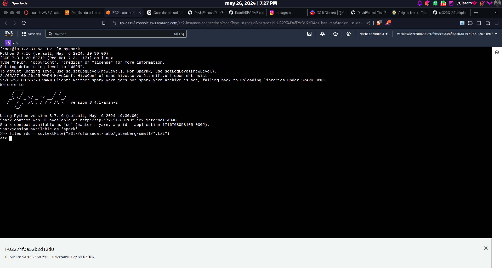
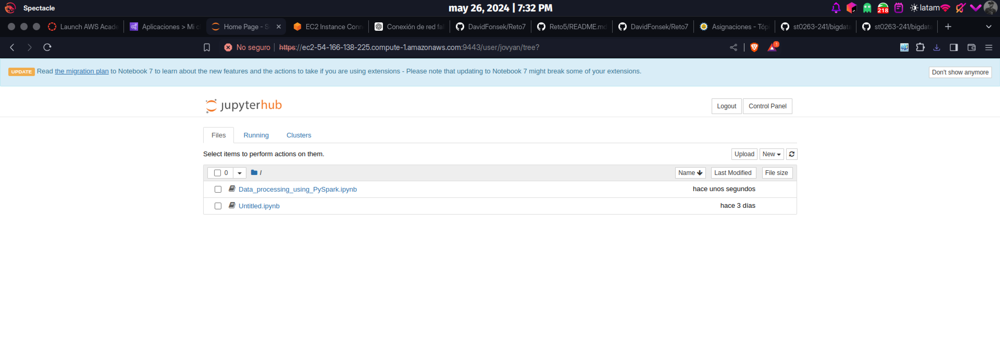

# Reto7
# ST0256 Tópicos Especiales en Telemática

## Estudiante:
- Nombre: David Fonseca Lara
- Correo: dfonsecal@eafit.edu.co

## Profesor:
- Nombre: Álvaro Ospina
- Correo: aeospinas@eafit.edu.co

# Reto 7 - Hive y Spark
## Cluster de Amazon EMR
Estoy usando un cluster de Amazon EMR que para el desarrollo de este reto. El cluster fue creado con las indicaciones del
[Lab 0](https://github.com/st0263eafit/st0263-241/blob/main/bigdata/00-lab-aws-emr/Install-AWS-EMR.pdf)

1.Intenté hacerlo por consola, pero no me funcionó

2.Así que subí el archivo para hacerlo en el Jupyter

3.Preferí hacerlo en un archivo nuevo para ir copiando bloque por bloque e ir comprendiendo

